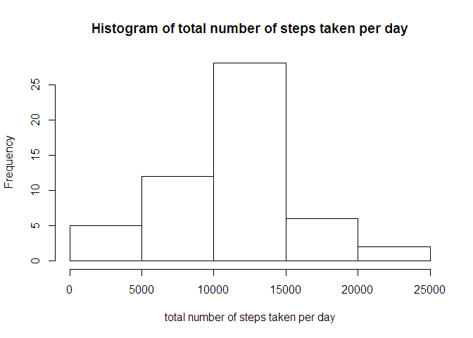
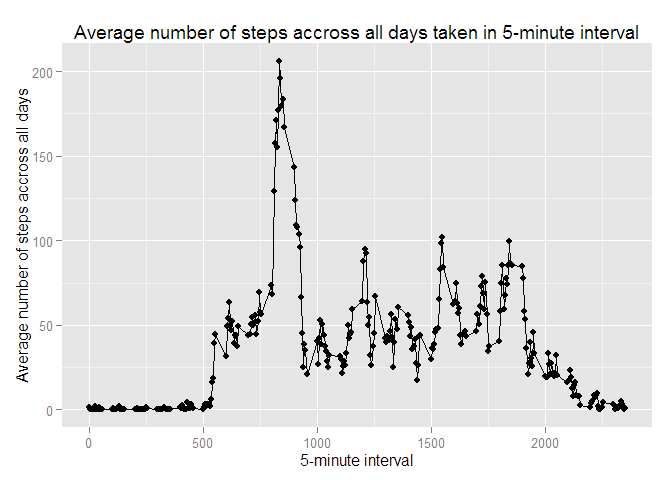
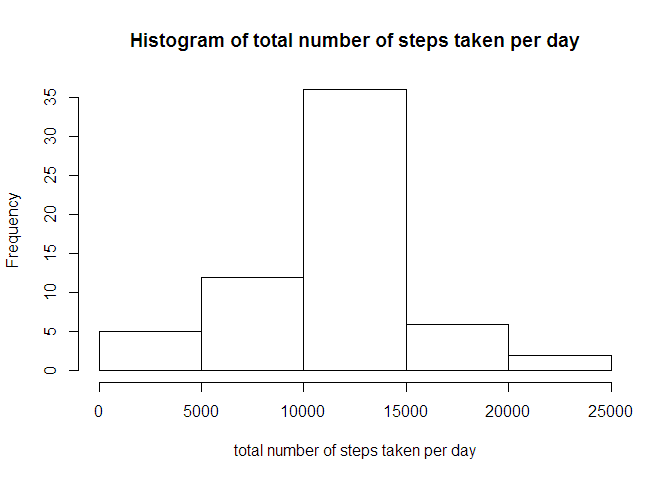
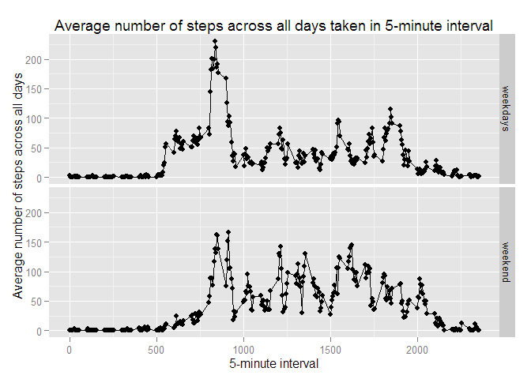

# Reproducible Research: Peer Assessment 1


## Loading and preprocessing the data
As a very first step we need to unzip the dataset.

```r
unzip("activity.zip")
```

Then we can read dataset and assign it to some variable.

```r
activity.dataset <- read.csv("activity.csv")
```

According to assignment conditions, we expect **17568** records. Just check it up.

```r
nrow(activity.dataset)
```

```
## [1] 17568
```


## What is mean total number of steps taken per day?

For this part of assignment we need to:

1. Calculate the total number of steps taken per day
2. Make a histogram of the total number of steps taken each day
3. Calculate and report the mean of the total number of steps taken per day
4. Calculate and report the median of the total number of steps taken per day

Hopefully we can ignore the missing values in the dataset.


```r
steps.per.day<-aggregate(steps ~ date,data = activity.dataset,sum)

hist(
    steps.per.day$steps,
    main = "Histogram of total number of steps taken per day",
    xlab ="total number of steps taken per day")
```

 

```r
mean(steps.per.day$steps)
```

```
## [1] 10766.19
```

```r
median(steps.per.day$steps)
```

```
## [1] 10765
```


## What is the average daily activity pattern?

In this part of assignment we have to:

1. Make a time series plot of the 5-minute interval (x-axis) and the
average number of steps taken, averaged across all days (y-axis)

2. Calculate which 5-minute interval, on average across all the days
in the dataset, contains the maximum number of steps?


```r
average.steps.per.interval<-aggregate(steps ~ interval, data=activity.dataset,mean)


require(ggplot2)
```

```
## Loading required package: ggplot2
```

```r
qplot(interval,
    steps,
    main="Average number of steps accross all days taken in 5-minute interval",
    xlab="5-minute interval",
    ylab ="Average number of steps accross all days",
    data=average.steps.per.interval)+geom_line()
```

 

```r
maximum.average.steps.interval<-
    average.steps.per.interval[which.max(average.steps.per.interval$steps),]$interval

maximum.average.steps.interval
```

```
## [1] 835
```

We can try to covert interval value expessed in minutes after midnight to more 
convinient hours and seconds.


```r
paste(
    maximum.average.steps.interval %/% 60, "H ",
    maximum.average.steps.interval %% 60, "M")
```

```
## [1] "13 H  55 M"
```

## Imputing missing values

This part of assignment is about missing (NA) values. We will need to:

1. Calculate and report the total number of missing values
in the dataset (i.e. the total number of rows with NAs)

2. Devise a strategy for filling in all of the missing values in the dataset. 
For each missing value on some 5-minute interval, we will use average value for
that interval across all days. 

3. Create a new dataset that is equal to the original
dataset but with the missing data filled in.

4. Make a histogram of the total number of steps taken each day
and Calculate and report the mean and median total number
of steps taken per day. 

5. Analyze if these values differ from the estimates from the first part
of the assignment? 

6. Analyze what is the impact of imputing missing data
on the estimates of the total daily number of steps?

Fortunately, as we can see, we only have some NA in `steps` variable.


```r
sapply(activity.dataset,function(x){sum(is.na(x))})
```

```
##    steps     date interval 
##     2304        0        0
```

We will build renovated activity dataset by imputing "estimated" values instead
each missing value. For each missing value on some interval on some day, we 
will use average value across all days for that 5-minute interval. Hopefully
 we already have averages for each interval stored in `steps.per.interval`
 variable.
In order to match missing values with values from `steps.per.interval` we 
will build a auxiliary dataset by merging `activity.dataset` and
`steps.per.interval` by `interval` variable. In this auxiliary
dataset `step.x` variable will contain original data for each date and 5-minute
interval (including NA values), and `step.y` variable will contain average 
amount of steps across all days for given 5-minute interval 


```r
renovated.activity.dataset <-merge(
        activity.dataset,
        average.steps.per.interval,
        by="interval")

missing.values<-is.na(renovated.activity.dataset$steps.x)

#substitute missing values with averages
renovated.activity.dataset[missing.values,"steps.x"]<-
    renovated.activity.dataset[missing.values,"steps.y"]

#clean up unnecessary variable
renovated.activity.dataset$steps.y<-NULL

#rename "steps.x" introduced by merge back to just "steps"
names(renovated.activity.dataset)[names(renovated.activity.dataset)=="steps.x"]<-"steps"
```

Check it up.

```r
sum(is.na(renovated.activity.dataset))
```

```
## [1] 0
```

And now we can redraw the histogram and recalculate our mean and median on 
data with no NA values.


```r
renovated.steps.per.day<-aggregate(steps ~ date,data = renovated.activity.dataset,sum)

hist(
    renovated.steps.per.day$steps,
    main = "Histogram of total number of steps taken per day",
    xlab ="total number of steps taken per day")
```

 

```r
mean(renovated.steps.per.day$steps)
```

```
## [1] 10766.19
```

```r
median(renovated.steps.per.day$steps)
```

```
## [1] 10766.19
```

## Are there differences in activity patterns between weekdays and weekends?
Here we need to:

1. Create a new factor variable in the dataset with two 
levels – “weekday” and “weekend” indicating whether a given date
is a weekday or weekend day.

2. Make a panel plot containing a time series plot of the 5-minute 
interval (x-axis) and the average number of steps taken, 
averaged across all weekday days or weekend days (y-axis).

We will use wonderfull lubridate library.


```r
require(lubridate)

#Unfortunately suppressWarnings is the only way I found to supress 
#timezone related warning on my windows platform
suppressWarnings(
    renovated.activity.dataset$week.part<-factor(
        wday(ymd(renovated.activity.dataset$date),label = T) %in% c("Sun","Sat"),
        labels=c("weekdays","weekend")))

average.steps.per.interval<-
    aggregate(
        steps ~ interval + week.part,
        data=renovated.activity.dataset,mean)

require(ggplot2)
qplot(
    interval,
    steps,
    data=average.steps.per.interval,
    main="Average number of steps across all days taken in 5-minute interval",
    xlab="5-minute interval",
    ylab ="Average number of steps across all days",
    facets = week.part ~ .)+geom_line()
```

 
